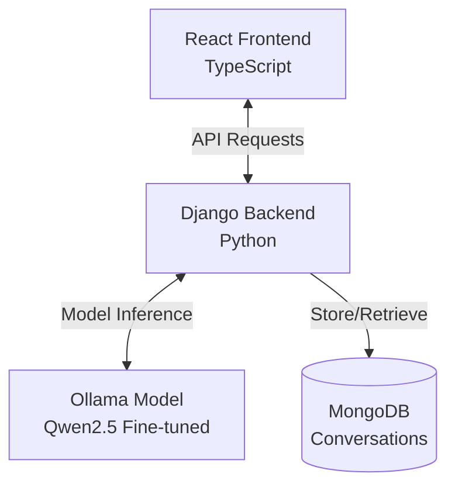

# 404_finders - Algerian Darija Chat Application

A full-stack chat application featuring a QLoRA fine-tuned Qwen2.5-3B model specialized in understanding and responding to Algerian Darija dialect.

## Overview

This project demonstrates fine-tuning a large language model (LLM) for a specific linguistic task - supporting Algerian Darija, a dialect that's underrepresented in mainstream AI models. The application provides a user-friendly interface for natural conversations in Darija.

## Architecture



## Tech Stack

### Frontend
- React 19 + TypeScript
- Vite
- shadcn/ui + Tailwind CSS
- React Router

### Backend
- Django 6.0
- MongoDB (Djongo ODM)
- Ollama for model inference
- Rate limiting & authentication

### AI Model
- **Base Model**: Qwen2.5-3B-Instruct-bnb-4bit (3 billion parameters)
- **Fine-tuning Method**: LoRA (rank=64, all linear layers)
- **Training Data**: 7,501 examples (Darija messages + translations + synthetic)
- **Deployment**: GGUF Q4_K_M via Ollama

## Features

- 💬 Natural conversations in Algerian Darija
- 🔐 User authentication and authorization
- 📝 Persistent conversation history
- 🌓 Dark/light theme support
- 📱 Responsive design
- 🤖 Model selection capability
- 🛡️ Rate limiting for API protection

## Quick Start

### Prerequisites

- Node.js 18+
- Python 3.8+
- MongoDB
- Ollama with the fine-tuned model

### Installation

1. **Clone the repository**
   ```bash
   git clone <repository-url>
   cd fine-tuning
   ```

2. **Setup Backend**
   ```bash
   cd server
   pip install -r requirements.txt
   python manage.py migrate
   python manage.py runserver
   ```

3. **Setup Frontend**
   ```bash
   cd client
   pnpm install
   pnpm dev
   ```

4. **Configure Environment**
   - See [`client/README.md`](client/README.md) for frontend configuration
   - See [`server/README.md`](server/README.md) for backend configuration

## Project Structure

```
.
├── client/              # React frontend application
├── server/              # Django backend API
├── llm/                 # Model fine-tuning & deployment files
├── research.md          # Detailed fine-tuning methodology
├── *.json              # Data processing files
└── README.md           # This file
```

## Fine-Tuning Process

The model was fine-tuned using LoRA on a dataset of 7,501 training examples (1,000 original Darija messages + synthetic data). The training data was collected from Hugging Face, cleaned, and enhanced with translations and generated conversations.

**Why LoRA?**
- Efficient: Only trains adapter weights, not the entire model
- Resource-friendly: Requires significantly less GPU memory
- Maintains quality: Preserves base model capabilities while adding new skills

**Model Pipeline**:
1. Base Model: Qwen2.5-3B-Instruct-bnb-4bit
2. Fine-tuning: LoRA adapters with rank=64
3. Conversion: GGUF Q4_K_M quantization
4. Deployment: Ollama with custom Modelfile

For technical details, training notebooks, and model files, see [`llm/README.md`](llm/README.md).
For methodology and research decisions, see [`research.md`](research.md).

## Documentation

- [Frontend Documentation](client/README.md)
- [Backend Documentation](server/README.md)
- [Model Fine-Tuning & Deployment](llm/README.md)
- [Research & Methodology](research.md)

## Team

**404_finders** - BuildIT
