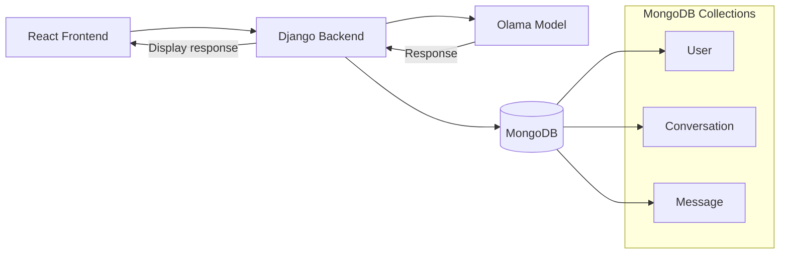

# 404_finders README

## 1 . the probelematic (why fine tunning)

tranning a model from scratch is an operation that requires  resoureces , for example  For state-of-the-art models like GPT-5, estimates range from approximately 10,000 to 80,000 ```H100-equivalent GPUs```

that is why  fine tunning came to place , rahter then traning an LLM   from scratch , we will pick a functioinng model and "fine tunne" it to do specific tasks  which will termoundsly 
cut the costs and resources need 

## 2 .  what is fine tunning 

Fine-tuning is the process of taking a ``` pre-trained artificial intelligence model ``` and training it further on a specific,  task-focused dataset so that it performs better on a particular domain or use case.

there are three types of fine tuuneing :

### full fine tunning : 
which updates all parameters of the moodel , indeed , in the making of our app we removed that option due to the huge resources amount needed for such a task 

### Lora : 
lora was the option to use in this project , lora cocnept is made to solve the issue stated befor in the full fine tunning , becuase its tracking only the weight changes, soo during training the original weghts dont get update , New small trainable weights ``` LoRA adapters ``` change.

```  
W + ΔW = W + BA
```
adding , to do the math more effiecntly , i actully use matrix decompostion  soo rather than having one big changes traked  matrix  ΔW , we have  2 smaller ones A and B that could be multplyed to get back the orginal


## Qlora 
same as lora but to optimaize preformance we use ```the quantzation``` technique , for example , in the wieght matrix we have each numbers stored in 32bit , to save space we Qaunatzied it to 8 bit

and it works like that (am presenting only the synacrohcous apporaoche becuase come on guys i have exams)

```d=[0-1000]```original wights we ant to represent it using only  ```[0-255]```

```

scale = Xmax - Xmin / Qmax - Qmin

for each x number in d do 

result_matrix  = round(x/scale)

endfor

```
we didnt  use becuse Qlora  it reduces the qualty and presisnceness of the model

## 3 .  soo what we chosed ?

as mentiond befor (i know u didnt read ) we used lora because we are already  plainig to use a light  weight model ```Qwen2.5-7B-Instruct-bnb-4bit``` (7b parameter)
which means that we dont want to risk more lose in quality of the anwsers by using Qlora , and we dont have much resources to use the brute pas de t7lab full fine tunning (this why we used an 7b parmater model)


## 4 . the traning data 

we found  a ```dataset``` for algerian darija meassges in ```huggingface``` website , clean it accesin it uisng ```python``` and clean it from emojis links ... ect (yeah i dont have more examples) 
then to structer it into a json format 

```json

   {
      "id": 1073,
      "text": "the life لاتبالي للاقاليات ياأخي",
    }

```

then translaing it a langauge that the model alredy understand , english , by adding 
translated  filed to json 

```py
import json
import time
import os
from groq import Groq

# --- CONFIGURATION ---
GROQ_API_KEY = "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"
INPUT_FILE = 'cleaned_data.json'
OUTPUT_FILE = 'result.json'
LIMIT = 1000
# Groq is fast, so we only need a small delay to stay safe
DELAY = 1.0 

client = Groq(api_key=GROQ_API_KEY)

def load_progress():
    """Loads result.json so we skip what's already done."""
    if os.path.exists(OUTPUT_FILE):
        with open(OUTPUT_FILE, 'r', encoding='utf-8') as f:
            try:
                data = json.load(f)
                return data.get('segments', [])
            except:
                return []
    return []

def translate_with_groq():
    # 1. Load original data
    try:
        with open(INPUT_FILE, 'r', encoding='utf-8') as f:
            original_data = json.load(f)
    except FileNotFoundError:
        print(f"Error: {INPUT_FILE} not found.")
        return

    all_source_segments = original_data.get('segments', [])[:LIMIT]
    
    # 2. Load finished items
    finished_segments = load_progress()
    finished_ids = {item['id'] for item in finished_segments}
    
    print(f"🚀 Groq Started. Progress: {len(finished_ids)}/{len(all_source_segments)}")

    # 3. Process
    for index, item in enumerate(all_source_segments):
        if item['id'] in finished_ids:
            continue

        try:
            # We use Llama 3.3 70B - powerful and fast
            completion = client.chat.completions.create(
                model="llama-3.3-70b-versatile",
                messages=[
                    {
                        "role": "system", 
                        "content": "You are a translation engine. Translate Algerian Darija to English. ONLY return the translation. No yapping. No explanations."
                    },
                    {
                        "role": "user", 
                        "content": item['text']
                    }
                ],
                temperature=0, # Keeps it literal
            )

            translation = completion.choices[0].message.content.strip()
            # Remove any possible quotes the AI might add
            clean_text = translation.replace('"', '')

            # Update item and save
            item['translation'] = clean_text
            finished_segments.append(item)

            # Save every single time so we never lose progress
            with open(OUTPUT_FILE, 'w', encoding='utf-8') as f:
                json.dump({"segments": finished_segments}, f, ensure_ascii=False, indent=2)

            print(f"ID {item['id']} Done ({len(finished_segments)}/{len(all_source_segments)})")
            
            # Tiny sleep to be polite to the API
            time.sleep(DELAY)

        except Exception as e:
            if "429" in str(e):
                print("\n⚠️ Groq Rate limit hit! Waiting 60s...")
                time.sleep(60)
            else:
                print(f"\n❌ Error on ID {item['id']}: {e}")
                break

    print(f"\n✅ MISSION COMPLETE! Results in {OUTPUT_FILE}")

if __name__ == "__main__":
    translate_with_groq()

```

 this is using groq api ``` llama-3.3-70b-versatile``` , only one 1000 meassges becuse groq quota ends around that number of 
 
 a strict prompt was used becuse at when u say jsut translte it will start to  say things like "no problem"  "here are options" which i dont want in my json 

 temperature=0 is putted to be to limit creativity
 of the reposne

 load_progress function Translating 1,000 items takes time. If your internet blips or your laptop goes to sleep at item 500 

 time.sleep(1.0) Even though Groq is fast, sending 1,000 requests in a few seconds looks like a ```DDoS attack``` to their servers.

 json.dump Most scripts save at the very end. If that script fails at 99%, you lose 99% of your work. By saving inside the loop


 certain cases, software products may be part of system products where hardware, as well as software, is delivered to a customer. Software products are produced with the help of the software process. The software process is a way in which we produce softw (bach ntlfhalk)


 ## 5 . using olama

 ## 6. the backend


## 7 . architecture daigram

### db class daigram:

 ```mermaid

classDiagram
    class User {
        +string id
        +string username
        +string email
        +string password_hash
    }

    class Conversation {
        +string id
        +string user_id
        +datetime started_at
        +datetime updated_at
    }

    class Message {
        +string id
        +string conversation_id
        +string user_id
        +string content
        +datetime timestamp
       
    }

    User "1" --> "0..*" Conversation : has
    Conversation "1" --> "0..*" Message : contains
    User "1" --> "0..*" Message : sends
    
```


