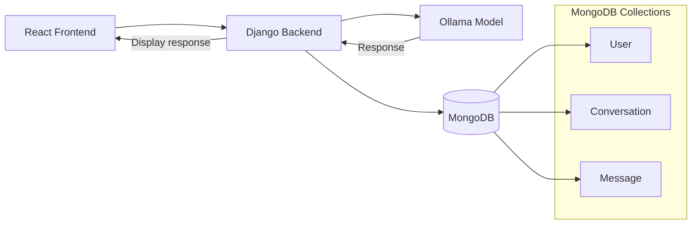
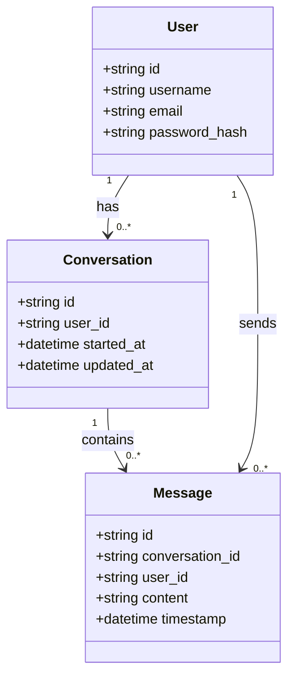

# 404_finders - Fine-Tuning Research & Methodology

## 1. The Problem (Why Fine-Tuning?)

Training a model from scratch is an operation that requires massive resources. For example, state-of-the-art models like GPT-5 require approximately 10,000 to 80,000 H100-equivalent GPUs.

That is why fine-tuning came into play. Rather than training an LLM from scratch, we pick a functioning model and "fine-tune" it to do specific tasks, which tremendously cuts the costs and resources needed.

## 2. What is Fine-Tuning?

Fine-tuning is the process of taking a pre-trained artificial intelligence model and training it further on a specific, task-focused dataset so that it performs better on a particular domain or use case.

There are three types of fine-tuning:

### Full Fine-Tuning

Updates all parameters of the model. In the making of our app, we removed this option due to the huge amount of resources needed for such a task.

### LoRA (Low-Rank Adaptation)

LoRA was the option we chose for this project. The LoRA concept is designed to solve the issue stated before in full fine-tuning. It tracks only the weight changes, so during training the original weights don't get updated. Instead, new small trainable weights (LoRA adapters) are added.

```
W + ΔW = W + BA
```

To do the math more efficiently, LoRA uses matrix decomposition. Rather than having one big changes matrix ΔW, we have 2 smaller matrices A and B that can be multiplied to reconstruct the original changes.

## QLoRA (Quantized LoRA)

Same as LoRA but to optimize performance we use the quantization technique. For example, in the weight matrix, each number is stored in 32-bit. To save space, we quantize it to 8-bit.

Quantization works as follows:

`d=[0-1000]` original weights we want to represent using only `[0-255]`

```
scale = (Xmax - Xmin) / (Qmax - Qmin)

for each x number in d:
    result_matrix = round(x / scale)
```

We didn't use QLoRA because it reduces the quality and precision of the model.

## 3. Our Choice

As mentioned before, we used LoRA because we are already planning to use a lightweight model: `Qwen2.5-7B-Instruct-bnb-4bit` (7 billion parameters).

This means we don't want to risk further loss in quality of the answers by using QLoRA, and we don't have the resources to use full fine-tuning. This is why we chose a 7B parameter model.

## 4. The Training Data

We found a dataset for Algerian Darija messages on the Hugging Face website. We accessed and cleaned it using Python, removing emojis, links, etc., then structured it into JSON format:

```json
{
  "id": 1073,
  "text": "the life لاتبالي للاقاليات ياأخي"
}
```

Then we translated it to a language the model already understands (English) by adding a `translated` field to the JSON:

```py
import json
import time
import os
from groq import Groq

# --- CONFIGURATION ---
GROQ_API_KEY = "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"
INPUT_FILE = 'cleaned_data.json'
OUTPUT_FILE = 'result.json'
LIMIT = 1000
# Groq is fast, so we only need a small delay to stay safe
DELAY = 1.0

client = Groq(api_key=GROQ_API_KEY)

def load_progress():
    """Loads result.json so we skip what's already done."""
    if os.path.exists(OUTPUT_FILE):
        with open(OUTPUT_FILE, 'r', encoding='utf-8') as f:
            try:
                data = json.load(f)
                return data.get('segments', [])
            except:
                return []
    return []

def translate_with_groq():
    # 1. Load original data
    try:
        with open(INPUT_FILE, 'r', encoding='utf-8') as f:
            original_data = json.load(f)
    except FileNotFoundError:
        print(f"Error: {INPUT_FILE} not found.")
        return

    all_source_segments = original_data.get('segments', [])[:LIMIT]

    # 2. Load finished items
    finished_segments = load_progress()
    finished_ids = {item['id'] for item in finished_segments}

    print(f"🚀 Groq Started. Progress: {len(finished_ids)}/{len(all_source_segments)}")

    # 3. Process
    for index, item in enumerate(all_source_segments):
        if item['id'] in finished_ids:
            continue

        try:
            # We use Llama 3.3 70B - powerful and fast
            completion = client.chat.completions.create(
                model="llama-3.3-70b-versatile",
                messages=[
                    {
                        "role": "system",
                        "content": "You are a translation engine. Translate Algerian Darija to English. ONLY return the translation. No yapping. No explanations."
                    },
                    {
                        "role": "user",
                        "content": item['text']
                    }
                ],
                temperature=0, # Keeps it literal
            )

            translation = completion.choices[0].message.content.strip()
            # Remove any possible quotes the AI might add
            clean_text = translation.replace('"', '')

            # Update item and save
            item['translation'] = clean_text
            finished_segments.append(item)

            # Save every single time so we never lose progress
            with open(OUTPUT_FILE, 'w', encoding='utf-8') as f:
                json.dump({"segments": finished_segments}, f, ensure_ascii=False, indent=2)

            print(f"ID {item['id']} Done ({len(finished_segments)}/{len(all_source_segments)})")

            # Tiny sleep to be polite to the API
            time.sleep(DELAY)

        except Exception as e:
            if "429" in str(e):
                print("\n⚠️ Groq Rate limit hit! Waiting 60s...")
                time.sleep(60)
            else:
                print(f"\n❌ Error on ID {item['id']}: {e}")
                break

    print(f"\n✅ MISSION COMPLETE! Results in {OUTPUT_FILE}")

if __name__ == "__main__":
    translate_with_groq()

```

### Translation Script Details

**Model Used**: Groq API with `llama-3.3-70b-versatile`

**Dataset Size**: 1,000 messages (Groq's free quota limit)

**Key Design Decisions**:

- **Strict Prompt**: A strict prompt was used because when you simply say "translate," the model starts adding unnecessary text like "no problem" or "here are options," which we don't want in our JSON.

- **temperature=0**: Set to 0 to limit creativity and ensure literal translations.

- **load_progress() Function**: Translating 1,000 items takes time. If your internet disconnects or your laptop goes to sleep at item 500, you don't want to lose progress. This function resumes from where it left off.

- **time.sleep(1.0)**: Even though Groq is fast, sending 1,000 requests in a few seconds looks like a DDoS attack to their servers. The delay keeps us within rate limits.

- **Incremental Saving**: Most scripts save at the very end. If the script fails at 99%, you lose 99% of your work. By saving inside the loop after each translation, we never lose progress.

## 5. Using Ollama

Ollama is used to serve the fine-tuned model locally. It provides an efficient API for inference and supports quantized models for optimal performance.

## 6. The Backend

Django backend serves as a bridge between the React frontend and the Ollama model, managing user authentication, conversation history, and API requests. MongoDB stores all conversations and messages.

## 7. Architecture Diagram



### Database Class Diagram


